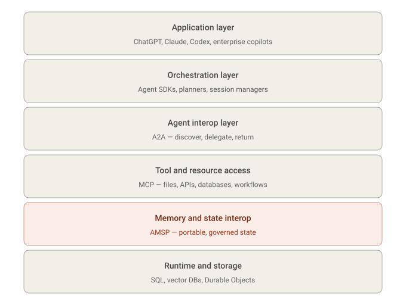

# AMSP: Agent Memory and State Protocol

**Draft v0.1** — a proposed open standard for portable, governed memory and state across AI agents, orchestration frameworks, and runtime providers.

---

## The Short Version

MCP standardized how agents access tools.
A2A is standardizing how agents talk to each other.
There is no open standard for what persists after the interaction.

That is the gap AMSP proposes to fill.

---

## Why This Matters

Every major agent platform — OpenAI, Anthropic, Google, xAI, Meta — is building its own memory feature. Every orchestration framework is adding its own state abstraction. Every enterprise pilot is discovering that "memory" means six different things depending on who you ask.

The 2026 memory landscape reflects this. Dedicated memory infrastructure has emerged from Mem0, Zep/Graphiti, Letta (stateful memory-first agents), and Supermemory. Runtime providers are shipping managed memory services. LangChain's Agent Protocol exposes a "Store" primitive, coupled to that protocol's agent model. Each of these is a valuable implementation. None of them is an open, governance-first contract that lets memory move safely between them.

Without that contract, enterprise buyers hit the same wall repeatedly:

- Memory that does not port when they switch vendors
- No standard deletion semantics for regulators
- No provenance trail across agent handoffs
- No scope model that survives a framework change
- No way to audit what their agents have inferred about them

AMSP is not another memory product. It is a proposed schema, lifecycle, and governance contract — the external surface that agent systems should agree on, regardless of how they store bytes internally.

---

## What AMSP Is (and Is Not)

**AMSP is:**
- An object schema for memory and state
- A lifecycle state model: active, stale, expired, contested, superseded, deleted
- An operation set: create, read, search, update, contest, expire, delete, export, import
- A scope model: local-session, agent-private, user-private, **user-portable**, team-shared, org-shared, public-reference
- A governance model: permissions, provenance (explicit, inferred, derived, imported), retention, audit
- A portability format, with clear ownership semantics for user-owned memory

**AMSP is not:**
- A storage engine
- A vector database
- A model or embedding architecture
- A runtime (Durable Objects, Postgres, Pinecone all stay where they are)
- A replacement for MCP or A2A

The analogy: MCP is to tool access what AMSP aims to be to durable state. Each protocol handles a different concern in the agent stack.

---

## Stack Positioning

AMSP sits between tool and resource access (MCP) and runtime storage. MCP standardizes how agents access tools. A2A standardizes how agents talk to each other. AMSP addresses the missing layer: portable, governed state.

---

## The Pressure Test

**"Why can't memory just be another MCP server?"**

It can be transported over MCP. But MCP is a tool and resource access contract. It does not standardize:

- memory schema (what a memory object actually is)
- scope semantics (who can see what, under what authority)
- retention and deletion (how forgetting works, and across which replicas)
- provenance (who wrote it, when, with what confidence, via what method)
- portability (can a user move their memory graph to a new provider?)

This is the same reason HTTP carries many payloads but JSON Schema, OAuth, and OpenAPI still exist as separate standards. Transport and semantics are different concerns.

---

## Repository Contents

- [`RFC-0001-AMSP.md`](./RFC-0001-AMSP.md) — the v0.1 specification
- `examples/` — sample memory objects and flow diagrams (coming)
- `reference/` — reference implementation notes (coming)

---

## How to Contribute

This is v0.1. The hard problems — conflict resolution, forgetting guarantees across replicas, identity continuity across providers, multi-agent co-ownership — are called out as open questions in the spec, not hand-waved past.

If you have thoughts:

- Open an issue to propose schema changes
- Open a PR with a new example flow
- Point out where MCP, A2A, or an existing memory framework already handles something cleanly

---

## Author

Sanej Bandgar — [@SanejBandgar](https://x.com/SanejBandgar)

Writing on enterprise AI strategy, capital allocation, and agentic systems.

---

## Acknowledgements

This draft emerged from a public exchange with Harrison Chase ([@hwchase17](https://x.com/hwchase17)), Reid B. Kimball ([@ReidBKimball](https://x.com/ReidBKimball)), and others on X in April 2026. The draft was pressure-tested against the current state of agent memory implementations (Mem0, Zep/Graphiti, Letta, Supermemory, OpenMemory, LangChain Agent Protocol) and runtime-vendor memory services.
