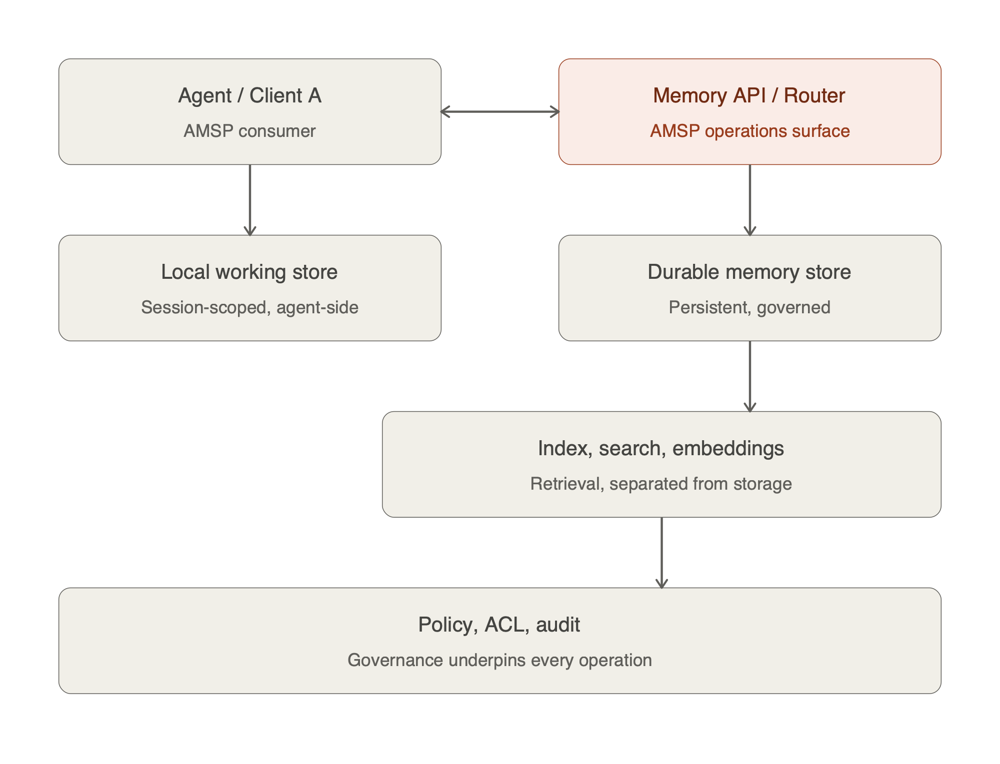

# RFC-0001: Agent Memory and State Protocol (AMSP)

**Status:** Draft v0.1
**Date:** 2026-04-21
**Author:** Sanej Bandgar (@SanejBandgar)
**License:** MIT
**Comments:** via GitHub issues and PRs

---

## 1. Abstract

This document proposes AMSP, an open standard for portable, governed memory and state across AI agents, orchestration frameworks, and runtime providers. AMSP defines a memory object schema, lifecycle states, operations, scope and governance model, and portability format.

AMSP does not specify storage implementations, model internals, embedding architectures, or runtime behavior. It is an external-contract specification, intended to interoperate with existing protocols (MCP, A2A) and coexist with vendor-specific memory implementations.

## 2. Status of This Memo

This is a v0.1 draft intended to solicit community review. It is not a finalized standard. Comments, issues, and pull requests are invited via the public repository.

## 3. Terminology

The key words **MUST**, **MUST NOT**, **REQUIRED**, **SHALL**, **SHALL NOT**, **SHOULD**, **SHOULD NOT**, **RECOMMENDED**, **MAY**, and **OPTIONAL** in this document are to be interpreted as described in RFC 2119 and RFC 8174.

**Agent**: A software system that uses a language model to plan, decide, and act, typically with access to tools and possibly other agents.

**Memory**: Durable state produced or consumed by an agent that persists beyond a single session, interaction, or runtime boundary.

**Memory object**: The atomic unit of durable state under AMSP, conforming to the schema in §8.

**Subject**: The entity a memory object is about (commonly a user, organization, team, agent, or entity), identified by a typed identifier.

**Scope**: The domain of visibility and ownership governing a memory object. See §11.

**Status**: The lifecycle state of a memory object. See §9.

**Provenance**: Metadata describing how, when, and by whom a memory was created or modified. See §12.

**Runtime**: The execution substrate that hosts an agent and its state (e.g., a Durable Object, a container, a serverless function, a local process).

**Conforming implementation**: A system that implements the required fields, operations, scope classes, and governance behaviors defined in this document.

## 4. Motivation

Current agent ecosystems have standardized two interoperability layers:

1. **Tool and resource access** via the Model Context Protocol (MCP), which now lives under the Agentic AI Foundation at the Linux Foundation.
2. **Agent-to-agent communication** via the Agent2Agent Protocol (A2A) and similar efforts.

A third layer remains fragmented: the durable memory and state that persists across sessions, tools, agents, and vendors.

The 2026 memory landscape is active. Dedicated memory infrastructure has emerged from companies like Mem0, Zep/Graphiti, Letta (stateful memory-first agents), and Supermemory. Runtime providers are shipping managed memory services. Orchestration frameworks expose their own state primitives. LangChain's Agent Protocol, for example, includes a "Store" resource for long-term memory, coupled to that protocol's agent model.

Each of these is a valuable implementation. None of them is an open, governance-first contract that lets memory move between them.

Without a shared external contract, the ecosystem hits four concrete problems:

- **Lock-in**: users and enterprises cannot move their memory graph between providers without loss of schema, provenance, or scope.
- **Compliance**: enterprises cannot prove deletion, audit provenance, or enforce retention uniformly across agents from different vendors.
- **Handoff**: agents from different vendors cannot safely share durable context in coordinator patterns.
- **Correction**: there is no standard way to contest, update, or invalidate a memory across replicas and derivatives.

AMSP aims to standardize the external contract (the schema, lifecycle, scope, and governance) without prescribing how implementations store, index, or retrieve data internally.

## 5. Non-Goals

AMSP does **not** attempt to:

- Standardize storage formats, databases, or vector indexes.
- Standardize retrieval algorithms, ranking heuristics, or embedding models beyond providing required metadata for external policies to evaluate.
- Replace MCP for tool and resource access.
- Replace A2A for inter-agent discovery and communication.
- Define agent harnesses, planners, or orchestration frameworks.
- Define user identity systems (though it interoperates with them; see §17).

## 6. Architecture Overview

A conforming AMSP implementation exposes:

1. A **memory object schema** (§8)
2. A set of **lifecycle states** (§9)
3. A set of **operations** (§10)
4. A **scope model** (§11) and **governance model** (§12)
5. **Retrieval metadata** sufficient for external selection (§13)
6. **Portability** via conforming import and export (§14)

AMSP is transport-agnostic in v0.1. Implementations MAY expose AMSP over HTTP/JSON, JSON-RPC, gRPC, or as an MCP server. The transport binding question is addressed in §17.



## 7. Memory Classes

AMSP distinguishes six memory classes. Implementations **MUST** support `working` and `semantic`. Other classes are **RECOMMENDED**.

| Class | Description | Typical retention |
|-------|-------------|-------------------|
| `working` | Short-lived context for an active task or session | minutes to hours |
| `episodic` | Specific past events, interactions, outcomes | weeks to years |
| `semantic` | Stable facts, concepts, entity attributes | persistent |
| `procedural` | How-to knowledge, workflows, playbooks | persistent |
| `preference` | User preferences, style, constraints | persistent |
| `commitment` | Promises, deadlines, open loops | until fulfilled or expired |

The `episodic / semantic / procedural` triad is consistent with existing convention across the memory framework ecosystem. AMSP extends it with `working`, `preference`, and `commitment` to capture distinctions that matter for retention, retrieval, and governance.

Classes MAY overlap in practice. The `memory_type` field records the primary classification. Implementations MAY define additional classes under a namespaced prefix (e.g., `x-vendor-*`), but SHOULD preserve compatibility with the base taxonomy.

## 8. Memory Object Schema

Every AMSP memory object **MUST** conform to the following JSON structure:

```json
{
  "memory_id": "string (URI or opaque ID)",
  "memory_type": "working | episodic | semantic | procedural | preference | commitment",
  "subject": {
    "type": "user | org | team | agent | entity | document",
    "id": "string"
  },
  "content": "string | structured object",
  "scope": "string (one of the scope classes in §11)",
  "status": "active | stale | expired | contested | superseded | deleted",
  "source": {
    "kind": "conversation | inference | derivation | import | external_system",
    "ref": "string (opaque reference to originating event or document)"
  },
  "created_at": "ISO 8601 timestamp",
  "updated_at": "ISO 8601 timestamp",
  "confidence": "number between 0.0 and 1.0",
  "retention": {
    "ttl": "ISO 8601 duration or null",
    "policy": "string (named retention policy)"
  },
  "permissions": {
    "read": ["string (principal URI)"],
    "write": ["string (principal URI)"],
    "delete": ["string (principal URI)"]
  },
  "provenance": {
    "writer": "string (principal URI of the creating agent or user)",
    "method": "explicit | inferred | derived | imported",
    "signature": "string (optional cryptographic signature)"
  },
  "portability": {
    "exportable": "boolean",
    "portable_owner": "string (principal URI, required if exportable)"
  },
  "embedding_ref": "string (optional pointer to an external index)",
  "links": [
    {
      "rel": "string (e.g., supports, contradicts, supersedes, derived_from)",
      "memory_id": "string"
    }
  ]
}
```

### 8.1 Required fields

An AMSP-compliant memory object **MUST** include: `memory_id`, `memory_type`, `subject`, `content`, `scope`, `status`, `source`, `created_at`, `updated_at`, `permissions`, `provenance`, `retention`.

### 8.2 Optional fields

An AMSP-compliant memory object **MAY** include: `confidence`, `portability`, `embedding_ref`, `links`.

Implementations MAY extend objects with additional fields under namespaced keys (e.g., `x-vendor-*`). Non-namespaced fields not defined in this spec SHOULD be ignored by conforming consumers.

### 8.3 Example

```json
{
  "memory_id": "mem_01HZX3A9",
  "memory_type": "preference",
  "subject": {
    "type": "user",
    "id": "user:sanej"
  },
  "content": "Prefers concise, operator-grade responses with structured frameworks.",
  "scope": "user-portable",
  "status": "active",
  "source": {
    "kind": "conversation",
    "ref": "thread_284_msg_19"
  },
  "created_at": "2026-04-21T15:10:00Z",
  "updated_at": "2026-04-21T15:10:00Z",
  "confidence": 0.94,
  "retention": {
    "ttl": null,
    "policy": "retain_until_deleted"
  },
  "permissions": {
    "read": ["agent:primary", "user:sanej"],
    "write": ["agent:primary"],
    "delete": ["user:sanej"]
  },
  "provenance": {
    "writer": "agent:primary",
    "method": "explicit"
  },
  "portability": {
    "exportable": true,
    "portable_owner": "user:sanej"
  },
  "links": []
}
```

## 9. Lifecycle States

Every memory object **MUST** carry a `status` value drawn from the following set:

| Status | Meaning |
|--------|---------|
| `active` | The memory is current and eligible for retrieval. |
| `stale` | The memory is suspected out of date but not formally expired. |
| `expired` | The memory's TTL has elapsed; no longer eligible for normal retrieval. |
| `contested` | The memory has been formally disputed. See §15. |
| `superseded` | The memory has been replaced by a newer object linked via `supersedes`. |
| `deleted` | The memory has been tombstoned; content MUST NOT be returned by `read` or `search`. |

Implementations **MUST NOT** return memories with status `deleted` to normal retrieval operations. Implementations **SHOULD** suppress `expired`, `superseded`, and `contested` memories from default retrieval unless explicitly requested.

## 10. Core Operations

AMSP defines eleven operations. Implementations **MUST** support `create`, `read`, `search`, `update`, `delete`, `export`, `import`. Others are **RECOMMENDED**.

| Operation | Description | Required |
|-----------|-------------|----------|
| `create` | Write a new memory object | yes |
| `read` | Retrieve a memory object by ID | yes |
| `search` | Query memory objects by content, scope, subject, time | yes |
| `update` | Modify fields on an existing memory object | yes |
| `link` | Create a typed relationship between two memory objects | no |
| `compact` | Derive a summary memory from a set of source memories | no |
| `contest` | Mark a memory as disputed and record the contesting party | no |
| `expire` | Transition a memory to `expired` status per retention policy | no |
| `delete` | Hard-delete a memory object and propagate to derivatives | yes |
| `export` | Produce a conforming portable representation | yes |
| `import` | Ingest a conforming portable representation | yes |

### 10.1 Illustrative API surface

A minimal HTTP/JSON binding might expose:

```
POST   /memories                   -> create
GET    /memories/{id}              -> read
POST   /memories/search            -> search
PATCH  /memories/{id}              -> update
POST   /memories/{id}/link         -> link
POST   /memories/compact           -> compact
POST   /memories/{id}/contest      -> contest
POST   /memories/{id}/expire       -> expire
DELETE /memories/{id}              -> delete
GET    /memories/export            -> export
POST   /memories/import            -> import
GET    /audit/{memory_id}          -> provenance trail
```

This binding is illustrative. AMSP does not require HTTP; see §17.

## 11. Scope Model

Memory objects **MUST** declare exactly one scope. The following scope classes are defined:

| Scope | Visibility and ownership |
|-------|-------------------------|
| `local-session` | Valid only within the active session; expires when the session ends |
| `agent-private` | Visible only to the creating agent instance |
| `user-private` | Visible to the user and their authorized agents within a single provider boundary |
| `user-portable` | Owned by the user, exportable across compliant providers |
| `team-shared` | Visible within a named team; requires team membership |
| `org-shared` | Visible within an organization; requires org membership |
| `public-reference` | Publicly readable (e.g., published entity facts) |

### 11.1 The user-private vs user-portable distinction

`user-private` and `user-portable` are deliberately separate. `user-private` describes a memory that is private to a user within a provider. The provider may index, retrieve, and govern it, but the memory is not necessarily exportable. `user-portable` describes a memory that the user owns across providers: it MUST be exportable via the `export` operation, and its `portability.portable_owner` field MUST identify the user as the owning principal.

This is the foundation of cross-vendor user data rights and enterprise procurement requirements around portability.

### 11.2 Scope enforcement

Implementations **MUST** enforce scope at both read and write time. Implementations **MUST NOT** treat a memory object without a declared scope as AMSP-compliant. Implementations **SHOULD** support declarative scope escalation (e.g., promoting a `user-private` memory to `team-shared` with explicit user consent), emitting an audit event on each escalation.

## 12. Governance Model

Every memory object **MUST** carry:

- Explicit `read`, `write`, and `delete` permissions identifying principals by URI.
- `provenance` metadata including the writer, the method (`explicit`, `inferred`, `derived`, `imported`), and optionally a signature.
- A `retention` policy expressed as either a TTL or a named policy reference.

### 12.1 Provenance methods

Implementations **MUST** set the `provenance.method` field to one of:

- `explicit`: directly provided by the user or a system of record
- `inferred`: inferred by a model or agent from observation
- `derived`: computed from multiple source memories (e.g., via `compact`)
- `imported`: brought in via `import` from another AMSP-compliant system

`inferred` and `derived` memories generally carry weaker authority than `explicit` ones. Consuming systems SHOULD be able to weight them accordingly at retrieval time.

### 12.2 Audit and deletion

Conforming implementations **MUST**:

- Authenticate all write operations.
- Emit audit events on `create`, `update`, `delete`, and `contest`.
- Support deletion propagation across indexes, derivatives, and summaries within a declared window (see §17 open question 6).

Conforming implementations **SHOULD**:

- Support encryption at rest with user- or org-held keys.
- Support signed provenance for cross-vendor portability.
- Expose an audit log queryable by subject and by memory_id.

## 13. Retrieval Semantics

AMSP separates **storage** from **selection**. AMSP does not prescribe a retrieval algorithm.

A conforming implementation **MUST** expose enough metadata for external retrieval policies to evaluate at least:

- **Relevance**: via `content` and optionally `embedding_ref`
- **Recency**: via `created_at` and `updated_at`
- **Confidence**: via the `confidence` field when present
- **Scope eligibility**: via `scope` and the requesting principal's authorizations
- **Status eligibility**: memories with status `deleted` MUST NOT be returned; `expired`, `superseded`, and `contested` SHOULD be suppressed by default
- **Retention validity**: via `retention`

Retrieval policy itself (ranking, token budgeting, task fit) is out of scope for v0.1. This separation is intentional: storage and selection are distinct concerns, and a protocol that collapses them loses portability.

### 13.1 Retrieval vs. injection

AMSP distinguishes three concepts:

- **Stored memory**: the set of memory objects in the store
- **Retrieved memory**: the set returned by `search` or `read` for a given query
- **Injected context**: the subset that an agent actually places in its active context window

AMSP governs the first two. The third is a runtime decision left to implementations.

## 14. Portability

AMSP implementations **MUST** support export and import of memory objects in a conforming JSON format.

### 14.1 Export requirements

The export **MUST** preserve:

- All required fields of every exported memory object
- Provenance chains (including signatures, where present)
- Link structure (relational edges between memory objects)
- Status values

The export **MAY**:

- Include embeddings; if included, they MUST be tagged with the model identifier that produced them.
- Be encrypted with user- or org-held keys.
- Be segmented by scope (e.g., exporting only `user-portable` memories).

### 14.2 Import requirements

An `import` operation on a conforming implementation **MUST**:

- Validate schema conformance
- Preserve provenance metadata (including original writer and method)
- Set `provenance.method` to `imported` on the receiving side when re-writing
- Apply local permissions policy (imported memories inherit the importer's scope enforcement)

### 14.3 Ownership of portable memory

For memories with scope `user-portable`:

- The `portability.portable_owner` field **MUST** identify the owning principal.
- The owning principal **MUST** have authority to initiate `export` regardless of who originally wrote the memory.
- Providers **SHOULD NOT** restrict `export` of `user-portable` memory as a means of creating lock-in.

## 15. Conflict Resolution

When two memory objects make contradictory claims about the same `subject`:

- Implementations **MUST** support transitioning objects to `status: contested`.
- Implementations **SHOULD** expose a `contest` operation that records the contesting principal, rationale, and timestamp.
- Implementations **MUST NOT** silently overwrite contested memory without emitting an audit event.
- Implementations **MAY** support a `supersedes` link relation to indicate deliberate replacement, in which case the superseded object transitions to `status: superseded`.

Automatic conflict resolution (e.g., newest-wins, highest-confidence-wins) is permitted but **MUST** be transparent and auditable.

## 16. Security and Privacy Considerations

- Memory objects frequently contain personal, proprietary, or regulated data. Implementations **MUST** support encryption at rest.
- Write authority **MUST** be authenticated. Unauthenticated write operations MUST be rejected.
- Cross-vendor export **SHOULD** support signed provenance to prevent tampering during transfer.
- Deletion **MUST** be auditable. Implementations **SHOULD** emit a `memory.deleted` audit event that includes the principal who initiated the deletion and the retention policy that authorized it.
- Implementations **SHOULD** treat `inferred` and `derived` memories as lower-trust by default and expose them for user review before surfacing them in new contexts.
- Multi-tenant implementations **MUST** enforce tenant isolation at the storage and retrieval layers.
- Implementations **SHOULD** address memory poisoning (e.g., adversarial writes that inject malicious context) as a threat model.

## 17. Open Questions

The following issues are deliberately left unresolved in v0.1, to be addressed in v0.2:

1. **Identity continuity**: How is "the same user" represented across providers? Candidate directions: Decentralized Identifiers (DIDs), verifiable credentials, user-held keys.
2. **Multi-agent co-ownership**: What are the merge semantics when two agents hold `write` authority and write to the same subject? Candidate directions: CRDT-style semantics, explicit arbitration via `contest`.
3. **Compaction provenance**: When `compact` produces a `derived` memory from source memories, should the derived memory retain Merkle-style links to sources for verifiability?
4. **Transport binding**: Should AMSP define a native transport (HTTP/JSON), ride on MCP as a specific server type, or remain transport-agnostic? Community input requested.
5. **Embedding portability**: Are embeddings part of the portable export, or should they be regenerated from `content` by the importing system? v0.1 permits either.
6. **Forgetting guarantees**: What is the minimum propagation window for compliant deletion across replicas, indexes, and derivative summaries? Regulatory alignment (GDPR Art. 17, CCPA) needs review.
7. **Query model**: What is the minimum interoperable query model that `search` must support across implementations?
8. **Agent Protocol Store bridge**: LangChain's Agent Protocol Store solves overlapping problems. A conformance bridge may be desirable.
9. **Enterprise-portable scope**: Should `user-portable` and a future `enterprise-portable` scope use the same export semantics, or diverge?

## 18. Change Log

- **2026-04-21**: v0.1 initial public draft.

## 19. References

- RFC 2119: Key words for use in RFCs
- RFC 8174: Ambiguity of Uppercase vs Lowercase in RFC 2119
- Model Context Protocol specification: modelcontextprotocol.io
- Agent2Agent (A2A) Protocol: Google, 2025
- LangChain Agent Protocol: LangChain, 2025

## 20. Acknowledgements

This draft was developed following a public exchange on X with Harrison Chase ([@hwchase17](https://x.com/hwchase17)) in April 2026.
